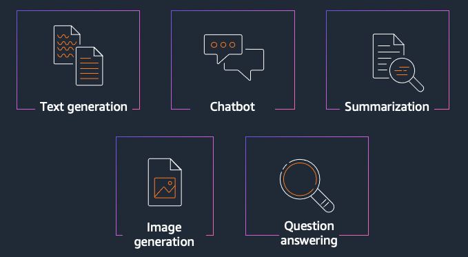

# Amazon Bedrock Workshop

## Introduction to the Repository and Workshop

The goal of this workshop is to give you hands-on experience leveraging foundation models (FMs) through Amazon Bedrock. Amazon Bedrock is a fully managed service that provides access to FMs from third-party providers and Amazon; available via an API. With Bedrock, you can choose from a variety of models to find the one that’s best suited for your use case.

Within this series of labs, you will be taken through some of the most common usage patterns we are seeing with our customers for Generative AI. We will explore techniques for generating text and images, creating value for organizations by improving productivity. This is achieved by leveraging foundation models to help in composing emails, summarizing text, answering questions, building chatbots, and creating images. You will gain hands-on experience using Bedrock APIs, SDKs, and open-source software for example LangChain and FAISS to implement these usage patterns.

This workshop is intended for developers and solution builders.

What’s included in this workshop:

- Text Generation \[Estimated time to complete - 30 mins\]
- Text Summarization \[Estimated time to complete - 30 mins\]
- Questions Answering \[Estimated time to complete - 45 mins\]  
- Chatbot \[Estimated time to complete - 45 mins\]
- Image Generation \[Estimated time to complete - 30 mins\]

<div align="center">



</div>
 
Workshop Link: [https://catalog.us-east-1.prod.workshops.aws/workshops/a4bdb007-5600-4368-81c5-ff5b4154f518/en-US/](https://catalog.us-east-1.prod.workshops.aws/workshops/a4bdb007-5600-4368-81c5-ff5b4154f518/en-US)


## Using these notebooks

Start by cloning the workshop repo

```sh
git clone https://github.com/aws-samples/amazon-bedrock-workshop.git
cd amazon-bedrock-workshop
```

The bedrock SDK is not already a part of boto3. To download the additional python wheel run the following script
```sh
bash ./download-dependencies.sh
```
This script will create a `dependencies` folder and download the relevant SDKs needed to use Amazon Bedrock. Which can then be installed as follows:

```bash
pip install ./dependencies/botocore-1.29.162-py3-none-any.whl --force-reinstall
pip install ./dependencies/boto3-1.26.162-py3-none-any.whl --force-reinstall
pip install ./dependencies/awscli-1.27.162-py3-none-any.whl --force-reinstall
```

Following this a bedrock client can be created as follows:

```python
import boto3
bedrock = boto3.client("bedrock", region_name="us-east-1")
```

If you need to use a specific role to access bedrock, you can do so using a session as follows:

```python
import boto3
session = boto3.session.Session(profile_name='bedrock')
boto3_bedrock = session.client("bedrock", region_name="us-east-1")
```

## Content

This repository contains notebook examples for the Bedrock Architecture Patterns workshop. The notebooks are organised by module as follows:

## Intro

[Simple Bedrock Usage](./00_Intro/bedrock_boto3_setup.ipynb)

This notebook shows setting up the boto3 client and some basic usage of bedrock.

### Generation

[Simple use case with boto3](./01_Generation/00_generate_w_bedrock.ipynb)

In this notebook, you generate text using Amazon Bedrock. We demonstrate consuming the Amazon Titan model directly with boto3 

[Simple use case with LangChain](./01_Generation/01_zero_shot_generation.ipynb)

We then perform the same task but using the popular frame LangChain

[Generation with additional context](./01_Generation/02_contextual_generation.ipynb)

We then take this further by enhancing the prompt with additional context in order to improve the response.

### Summarization

[Small text summarization](./02_Summarization/01.small-text-summarization-claude.ipynb)

In this notebook, you use use Bedrock to perform a simple task of summarising a small piece of text. 

[Long text summarization](./02_Summarization/02.long-text-summarization-titan.ipynb)

The above approach may not work as the content to be summarized gets larger and exceeds the max tokens of the model. In this notebook we show an approach of breaking the file up into smaller chunks, summarizing each chunk, and then summarizing the summaries.

### Question Answering

[Simple questions with context](./03_QuestionAnswering/00_qa_w_bedrock_titan.ipynb)

This notebook shows a simple example answerting a question with given context by calling the model directly. 

[Answering questions with Retrieval Augmented Generation](./03_QuestionAnswering/01_qa_w_rag_claude.ipynb)

We can improve the above process by implementing an architecure called Retreival Augmented Generation (RAG). RAG retrieves data from outside the language model (non-parametric) and augments the prompts by adding the relevant retrieved data in context.

### Chatbot

[Chatbot using Claude](./04_Chatbot/00_Chatbot_Claude.ipynb)

This notebook shows a chatbot using Claude

[Chatbot using Titan](./04_Chatbot/00_Chatbot_Titan.ipynb)

This notebook shows a chatbot using Titan

### Text to Image

[Image Generation with Stable Diffusion](./05_Image/Bedrock%20Stable%20Diffusion%20XL.ipynb)

This notebook demonstrates image generation with using the Stable Diffusion model
